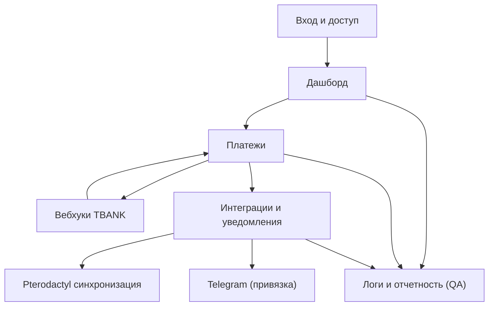

## 1. Product Overview
Модернизация биллинга: усиление безопасности, наблюдаемости и интеграций платежей/панелей.
Цель — надежные платежи TBANK (включая вебхуки), уведомления (Email/Telegram), синхронизация Pterodactyl, привязка Telegram и QA/отчетность.

## 2. Core Features

### 2.1 User Roles
| Role | Registration Method | Core Permissions |
|------|---------------------|------------------|
| Пользователь | Создание админом / self-signup (если включено) | Оплачивает счета, привязывает Telegram, видит статус услуг и историю уведомлений |
| Оператор/Финансы | Назначение админом | Управляет счетами/платежами, смотрит логи платежей/вебхуков, запускает повторную доставку уведомлений |
| Администратор | Назначение админом | Настраивает безопасность, интеграции (TBANK/Pterodactyl/Telegram/SMTP), доступы, QA и отчетность |

### 2.2 Feature Module
1. **Вход и доступ**: логин, управление сессиями, роли и права, базовые меры защиты.
2. **Дашборд**: сводка платежей/вебхуков/уведомлений/синхронизаций, активные инциденты.
3. **Платежи**: создание/управление счетами, прием TBANK платежей, обработка вебхуков, журнал событий.
4. **Интеграции и уведомления**: SMTP email, Telegram-уведомления, привязка Telegram, синхронизация Pterodactyl.
5. **Логи и отчетность (QA)**: аудит действий, технические логи, QA-проверки, отчеты и выгрузки.

### 2.3 Page Details
| Page Name | Module Name | Feature description |
|-----------|-------------|---------------------|
| Вход и доступ | Логин | Выполнять вход по email/паролю; показывать ошибки; ограничивать частоту попыток |
| Вход и доступ | Управление сессией | Завершать сессии; принудительно разлогинивать при смене критичных настроек |
| Дашборд | KPI и алерты | Показывать статусы: «вебхуки TBANK», «очередь уведомлений», «последняя синхронизация Pterodactyl», ошибки за период |
| Дашборд | Быстрые действия | Переходы: создать счет, открыть последние ошибки, запустить синхронизацию |
| Платежи | Счета/инвойсы | Создавать и просматривать счета; менять статус (черновик/выставлен/оплачен/отменен); искать/фильтровать |
| Платежи | TBANK платежи | Генерировать ссылку/форму оплаты; хранить идентификаторы транзакций; показывать итоговый статус |
| Платежи | Вебхуки TBANK | Принимать вебхуки; валидировать подпись/секрет; обеспечивать идемпотентность; логировать доставку |
| Платежи | Реестр событий | Просматривать цепочку событий по счету/транзакции (создано/обновлено/ошибка) |
| Интеграции и уведомления | Email-уведомления | Настраивать SMTP; отправлять уведомления по событиям (оплата/ошибка/синк); повторная отправка |
| Интеграции и уведомления | Telegram (привязка) | Привязывать Telegram через код/Deep-link; подтверждать владение; отвязывать; хранить chat_id |
| Интеграции и уведомления | Telegram-уведомления | Отправлять сообщения о статусах; показывать историю отправок и ошибки доставки |
| Интеграции и уведомления | Pterodactyl синхронизация | Настраивать URL/ключ; синхронизировать серверы/услуги/статусы; ручной запуск и расписание |
| Логи и отчетность (QA) | Аудит безопасности | Записывать действия пользователей/админов (настройки, счета, интеграции); фильтровать/экспортировать |
| Логи и отчетность (QA) | Технические логи | Собирать структурированные логи по модулям (payments/webhooks/notify/ptero); поиск по correlation-id |
| Логи и отчетность (QA) | QA-проверки | Запускать чек-листы (вебхук тест, SMTP тест, Telegram тест, Pterodactyl ping); фиксировать результаты |
| Логи и отчетность (QA) | Отчеты | Формировать периодические отчеты (оплаты, ошибки, SLA вебхуков/уведомлений); выгружать CSV |

## 3. Core Process
**Пользовательский флоу**: пользователь входит → получает/видит счет → оплачивает через TBANK → система принимает вебхук и обновляет статус → отправляет email/Telegram уведомления → при необходимости синхронизирует состояние услуги с Pterodactyl → пользователь видит итоговый статус.

**Админ/Оператор флоу**: админ настраивает TBANK вебхук секреты, SMTP и Telegram, Pterodactyl API → оператор мониторит дашборд → при ошибках открывает логи, делает повторную доставку уведомлений/повторную синхронизацию → запускает QA проверки → формирует отчеты.

