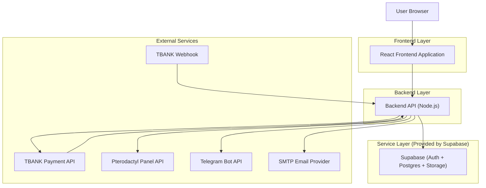
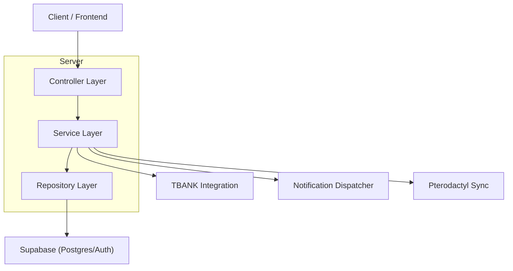
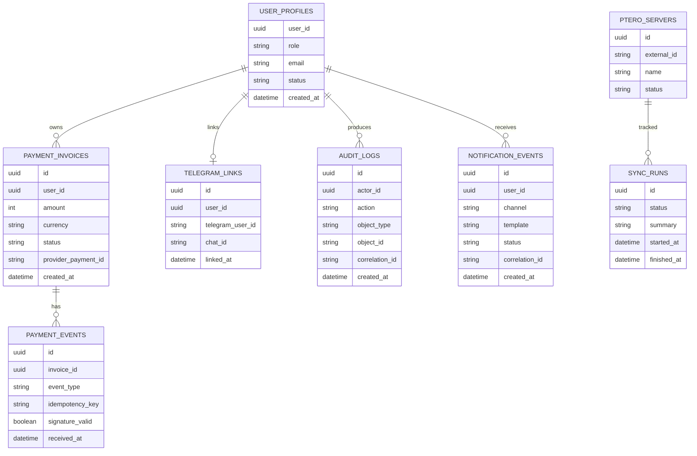

## 1.Architecture design


## 2.Technology Description
- Frontend: React@18 + vite + tailwindcss@3
- Backend: Node.js@20 + NestJS (или Express) + TypeScript
- Backend integrations: Supabase SDK (server-side only), TBANK SDK/REST, Telegram Bot API, SMTP (nodemailer), Pterodactyl REST

## 3.Route definitions
| Route | Purpose |
|-------|---------|
| /login | Вход и восстановление доступа |
| /dashboard | Сводка статусов: платежи/вебхуки/уведомления/синхронизация |
| /payments | Счета, транзакции TBANK, журнал вебхуков |
| /integrations | Настройки TBANK/SMTP/Telegram/Pterodactyl, тесты подключений |
| /logs-reports | Аудит, технические логи, QA и отчеты |

## 4.API definitions (If it includes backend services)
### 4.1 Core API
Auth
- POST /api/auth/login
- POST /api/auth/logout
- GET /api/auth/me

Payments + TBANK
- POST /api/payments/invoices
- GET /api/payments/invoices?query=
- GET /api/payments/invoices/:id
- POST /api/payments/invoices/:id/cancel
- POST /api/webhooks/tbank (прием событий, только server-to-server)

Notifications
- POST /api/notifications/test/email
- POST /api/notifications/test/telegram
- POST /api/notifications/resend/:notificationEventId

Telegram binding
- POST /api/telegram/link/start (выдать код/ссылку)
- POST /api/telegram/link/confirm (подтвердить код)
- POST /api/telegram/link/unlink

Pterodactyl sync
- POST /api/pterodactyl/sync/run
- GET /api/pterodactyl/sync/runs

Logs / QA / Reports
- GET /api/audit?from=&to=&actorId=&action=
- GET /api/logs?from=&to=&service=&level=&correlationId=
- POST /api/qa/run (запуск проверок)
- GET /api/reports/payments?from=&to=

### 4.2 Shared TypeScript types (examples)
```ts
export type UserRole = "user" | "support" | "admin";

export type PaymentOrderStatus = "draft" | "issued" | "paid" | "canceled" | "failed";

export interface PaymentInvoice {
  id: string;
  userId: string;
  amount: number;
  currency: "RUB";
  status: PaymentOrderStatus;
  tbankPaymentId?: string;
  createdAt: string;
}

export interface WebhookEvent {
  id: string;
  provider: "tbank";
  eventType: string;
  idempotencyKey: string;
  signatureValid: boolean;
  receivedAt: string;
  raw: unknown;
}

export type NotificationChannel = "email" | "telegram";

export interface AuditLogEntry {
  id: string;
  actorId: string;
  actorRole: UserRole;
  action: string;
  objectType: string;
  objectId?: string;
  correlationId?: string;
  createdAt: string;
}
```

## 5.Server architecture diagram (If it includes backend services)


## 6.Data model(if applicable)
### 6.1 Data model definition


### 6.2 Data Definition Language
User profiles (user_profiles)
```sql
CREATE TABLE user_profiles (
  user_id UUID PRIMARY KEY,
  email TEXT,
  role TEXT NOT NULL DEFAULT 'user',
  status TEXT NOT NULL DEFAULT 'active',
  created_at TIMESTAMPTZ NOT NULL DEFAULT NOW()
);

CREATE TABLE telegram_links (
  id UUID PRIMARY KEY DEFAULT gen_random_uuid(),
  user_id UUID NOT NULL,
  telegram_user_id TEXT NOT NULL,
  chat_id TEXT NOT NULL,
  linked_at TIMESTAMPTZ NOT NULL DEFAULT NOW()
);

CREATE TABLE payment_invoices (
  id UUID PRIMARY KEY DEFAULT gen_random_uuid(),
  user_id UUID NOT NULL,
  amount INT NOT NULL,
  currency TEXT NOT NULL DEFAULT 'RUB',
  status TEXT NOT NULL,
  provider_payment_id TEXT,
  created_at TIMESTAMPTZ NOT NULL DEFAULT NOW()
);

CREATE TABLE payment_events (
  id UUID PRIMARY KEY DEFAULT gen_random_uuid(),
  invoice_id UUID NOT NULL,
  event_type TEXT NOT NULL,
  idempotency_key TEXT NOT NULL,
  signature_valid BOOLEAN NOT NULL,
  received_at TIMESTAMPTZ NOT NULL DEFAULT NOW()
);

CREATE TABLE notification_events (
  id UUID PRIMARY KEY DEFAULT gen_random_uuid(),
  user_id UUID NOT NULL,
  channel TEXT NOT NULL,
  template TEXT NOT NULL,
  status TEXT NOT NULL,
  correlation_id TEXT,
  created_at TIMESTAMPTZ NOT NULL DEFAULT NOW()
);

CREATE TABLE audit_logs (
  id UUID PRIMARY KEY DEFAULT gen_random_uuid(),
  actor_id UUID NOT NULL,
  action TEXT NOT NULL,
  object_type TEXT NOT NULL,
  object_id TEXT,
  correlation_id TEXT,
  created_at TIMESTAMPTZ NOT NULL DEFAULT NOW()
);

GRANT SELECT ON user_profiles TO anon;
GRANT ALL PRIVILEGES ON user_profiles TO authenticated;
GRANT SELECT ON payment_invoices TO anon;
GRANT ALL PRIVILEGES ON payment_invoices TO authenticated;
```
